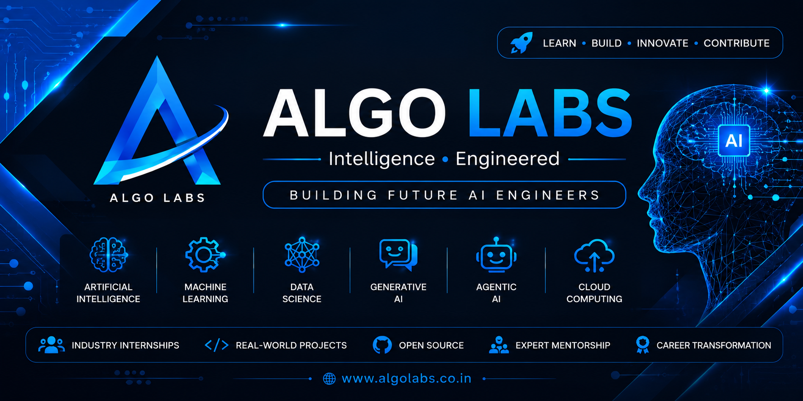

<p align="center">

</p>

<h1 align="center">🚀 ALGO LABS</h1>

<h3 align="center">
Intelligence • Engineered
</h3>

<h3 align="center">
Building Future AI Engineers
</h3>
<p align="center">


</p>
<p align="center">

<a href="https://www.algolabs.co.in">

</a>

<a href="https://www.linkedin.com/in/algo-labs/">

</a>

<a href="https://www.instagram.com/algolabs26/">

</a>

<a href="https://chat.whatsapp.com/CTlYdfJoplnFbyJ5OlORJv">

</a>

<a href="https://chat.whatsapp.com/DAn4VEo0VOxHJTVfnO61kx">

</a>

</p>

# 📊 GitHub Statistics

<p align="center">


</p>

<p align="center">


</p>
<p align="center">


</p>
# 🏆 GitHub Achievements

<p align="center">


</p>
## 💻 Programming


## 📊 Data Science


## 🤖 AI & ML


## ✨ Generative AI


## ☁️ Cloud & Deployment


<p align="center">


</p>
# 🎓 Industry Internship Programs

At **Algo Labs**, we focus on practical learning through real-world projects, GitHub collaboration, and AI innovation.

<table>
<tr>
<td align="center" width="25%">

### 🐍 Python

Beginner to Advanced

</td>

<td align="center" width="25%">

### 🤖 AI

Artificial Intelligence

</td>

<td align="center" width="25%">

### 🧠 ML

Machine Learning

</td>

<td align="center" width="25%">

### ⚡ GenAI

Generative AI

</td>

</tr>

<tr>

<td align="center">

### 📊 Data Science

</td>

<td align="center">

### 📈 Analytics

</td>

<td align="center">

### 🤖 Agentic AI

</td>

<td align="center">

### ☁ Cloud

</td>

</tr>

</table>

---

### Every Internship Includes

✅ Live Industry Projects

✅ Weekly Assignments

✅ GitHub Portfolio

✅ Mentor Support

✅ Code Reviews

✅ Open Source Contribution

✅ Resume Building

✅ Mock Interviews

✅ Final Capstone Project

✅ Internship Certificate
# 🚀 Featured AI Projects

| Project | Description |
|---------|-------------|
| 🤖 AI Interview Assistant | AI-powered interview preparation platform |
| 📄 Resume Analyzer | ATS-based resume evaluation system |
| 💬 PDF Chatbot | Chat with PDF documents using RAG |
| 🩺 Medical Chatbot | Healthcare AI Assistant |
| 🎤 Voice Assistant | Speech-to-Text AI Assistant |
| 😊 Face Recognition | Computer Vision Project |
| 📊 Business Dashboard | Data Analytics Dashboard |
| 🎓 Student Management AI | AI Academic Management |
| 📚 Research Assistant | AI Literature Review Tool |
| 🤖 Enterprise AI Agent | Multi-Agent AI Workflow |
| 📈 Stock Prediction | Machine Learning Forecasting |
| 🛒 Recommendation System | AI Recommendation Engine |

---

> 🚀 Every project follows Industry Standards using GitHub, Agile, Documentation, Testing and Deployment.
> # 🗺 AI Engineer Roadmap

```text
              START

                │

                ▼

        🐍 Python Programming

                │

                ▼

          Git & GitHub

                │

                ▼

              SQL

                │

                ▼

        Data Analytics

                │

                ▼

      Machine Learning

                │

                ▼

       Deep Learning

                │

                ▼

      Computer Vision

                │

                ▼

 Natural Language Processing

                │

                ▼

       Generative AI

                │

                ▼

     Prompt Engineering

                │

                ▼

        Vector Databases

                │

                ▼

       Retrieval Augmented Generation

                │

                ▼

          LangChain

                │

                ▼

          LangGraph

                │

                ▼

         Agentic AI

                │

                ▼

      Cloud Deployment

                │

                ▼

      Industry AI Engineer

```

# 🤝 Contribute to Algo Labs

We believe in **Learning by Building**.

Students, Developers and Researchers are welcome to contribute.

## Contribution Workflow

```text
Fork Repository

        ↓

Create Branch

        ↓

Develop Feature

        ↓

Commit Changes

        ↓

Push Code

        ↓

Create Pull Request

        ↓

Code Review

        ↓

Merge

```

---

### Ways to Contribute

🐍 Python Projects

🤖 Artificial Intelligence

🧠 Machine Learning

📚 Documentation

🎨 UI Design

🧪 Testing

🐞 Bug Fixes

💡 New Ideas

---

Let's build India's strongest AI Open Source Community together.

# 🌐 Connect With Algo Labs

| Platform | Link |
|----------|------|
| 🌍 Website | https://www.algolabs.co.in |
| 💼 LinkedIn | https://www.linkedin.com/in/algo-labs/ |
| 📸 Instagram | https://www.instagram.com/algolabs26/ |
| 👍 Facebook | https://www.facebook.com/profile.php?id=61574349973748 |
| 💬 AI Community | https://chat.whatsapp.com/CTlYdfJoplnFbyJ5OlORJv |
| 🎓 Internship Community | https://chat.whatsapp.com/DAn4VEo0VOxHJTVfnO61kx |
| 📞 Contact | +91 81474 49088 |

---

<div align="center">

# 🚀 ALGO LABS

### Intelligence • Engineered

### Building Future AI Engineers

---

🤖 Artificial Intelligence

🧠 Machine Learning

⚡ Generative AI

🤖 Agentic AI

☁ Cloud Computing

📊 Data Science

---

### 🌍 Learn • Build • Innovate • Contribute

**Open Source • Research • Live Internship • Innovation**

---

⭐ If you like our work, please consider **Starring ⭐ our repositories** and becoming part of the **Algo Labs AI Community**.

---

🌐 https://www.algolabs.co.in

📧 info.algolabs@gmail.com

📞 +91 81474 49088

Made with ❤️ by **Algo Labs**

</div>
